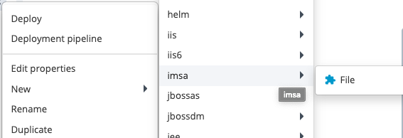
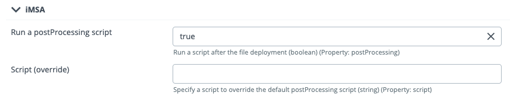

# xld-demo-file-extension

Exemple de définition d'un nouveau type d'artifact qui hérite de File de façon à pouvoir lancer l'exécution d'un script après le déploiement d'un fichier.

## Limite

Cet exemple a été ecrit dans un objectif de démonstration et n'a pas été validé pour une mise en production.

## Installation

- Copier le contenu du fichier synthetic.xml dans celui présent dans le répertoire <deploy_dir>/ext (si absent, copier le fichier)
- Copier le contenu du fichier xl-rules.xml dans celui présent dans le répertoire <deploy_dir>/ext (si absent, copier le fichier)
- Copier le répertoire imsa dans <deploy_dir>/ext
- Redémarrer le serveur Deploy.

Un nouveau type d'artifact est disponible : imsa > File

