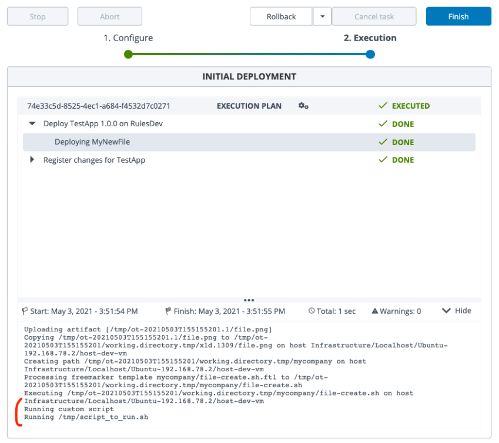

# xld-demo-file-extension

This is a sample definition of a new Digital.ai Deploy artifact, inheriting from the default File in order to run a command after the deployment of a file.

## Limitation

This a sample only, please do not use in production (not designed to manage all use cases)

## Installation steps

- Copy the content of the synthetic.xml file into the existing one in <deploy_dir>/ext
- Copy the content of the xl-rules.xml file into the existing one in <deploy_dir>/ext (if not present create a new one)
- Copy the newFile directory into <deploy_dir>/ext
- Restart the Deploy server

A new File type is available in mycompany > File

New properties:

---
Sample:

File with properties:

  

